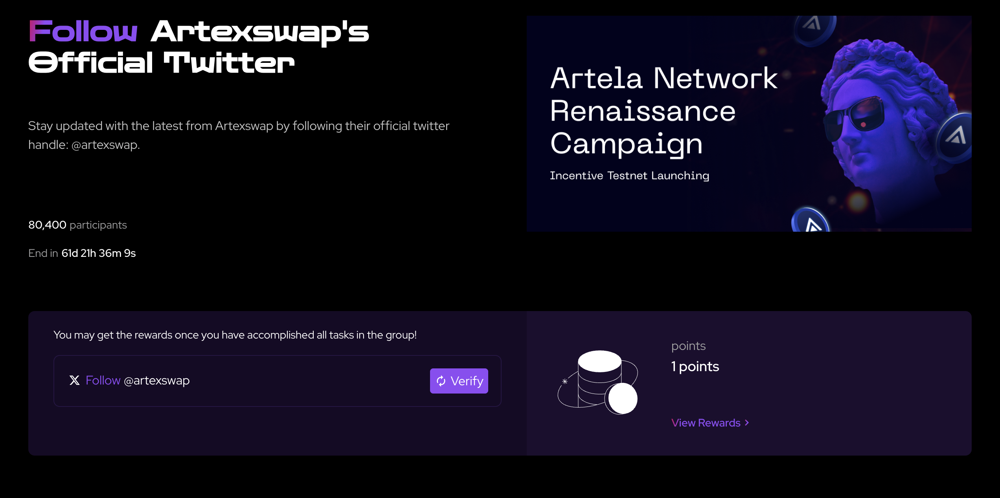
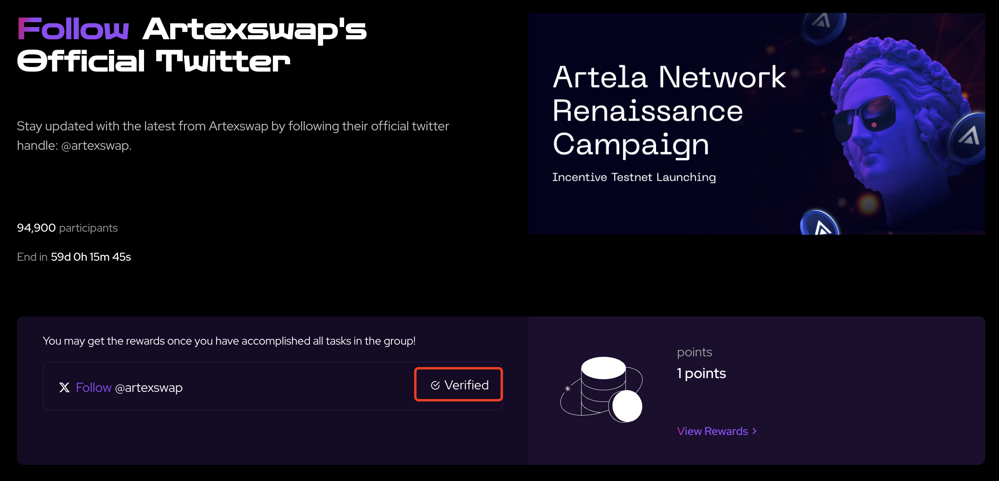
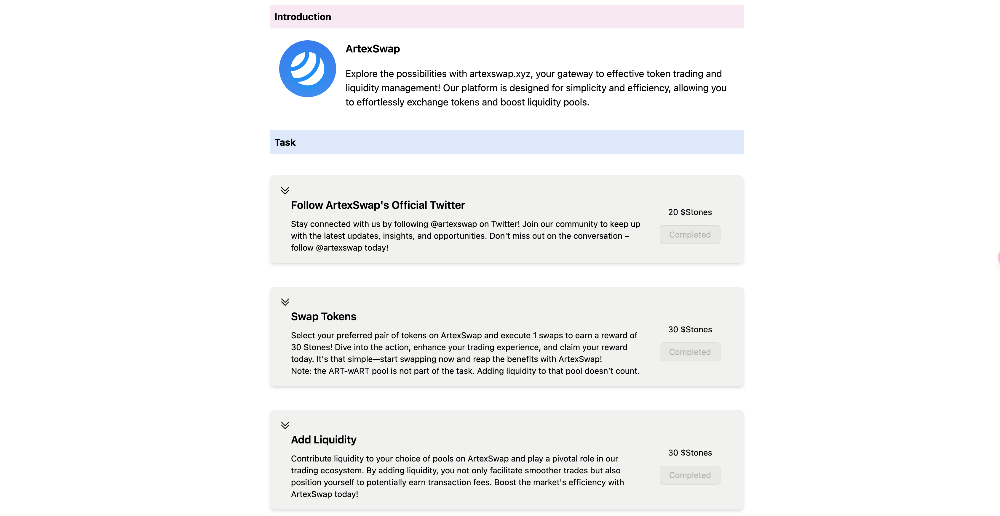

import Image from 'next/image'

# Artela Renaissance Event Phase 1 - Cornerstone

Artela is a blockchain L1 that focuses on scalability. The upcoming Renaissance event is a crucial airdrop activity for the Artela ecosystem, we can earn Renaissance activity points (stone) with interaction with Dapps. Don't miss out! 

ArtexSwap is underlying infrastructure in Artela, we can swap tokens and provide liquidity in ArtexSwap. With the Artela EVM++, we can swap assets in a more scalable, flexible and secure way.

First Enter Artela Renaissance Page:

We have e-bagger mode : https://renaissance.artela.network/e-beggar

and vision mode : https://renaissance.artela.network/vision

Renaissance is Artela's incentivized testnet campaign for developers and users to explore the possibilities of EVM++ and earn rewards.

To begin, You can get token from faucet from [1.3 #Get Token from Faucet](../overview/1.3guide)

After successfully receiving token, proceed to the event page:

https://renaissance.artela.network/e-beggar/6

Complete the following three tasks:

**Frist Mission: Follow ArtexSwap's Official Twitter**

Stay connected with us by following @artexswap on Twitter! Join our community to keep up with the latest updates, insights, and opportunities. Don't miss out on the conversation – follow @artexswap today!

Click on the mission button to enter the Mission page, Like this:

And enter twitter to follow:

<Image src="/pic/2twitter.png" width={500} height={500} />

Go back to Mission Page and click "Verify". It depend on ibook mission platform. So you can verify first on iBook mission page.

After finish all this, then you will verify the mission and claim the stone. 

<Image src="/pic/4congrats.png" width={500} height={500} />

**Second Mission: Swap Tokens!**

Select your preferred pair of tokens on ArtexSwap and execute 1 swaps to earn a reward of 30 Stones! Dive into the action, enhance your trading experience, and claim your reward today. It's that simple—start swapping now and reap the benefits with ArtexSwap!
Note: the ART-wART pool is not part of the task. Adding liquidity to that pool doesn’t count.

We can follow the instruction from [1.3 #Swap Token](./overview/1.3guide)

Once this step is completed, you can return to the event page. 
Click on the "verify" button for the second activity, and claim your stone reward.

**Third Mission: Add Liquidity**
Contribute liquidity to your choice of pools on ArtexSwap and play a pivotal role in our trading ecosystem. By adding liquidity, you not only facilitate smoother trades but also position yourself to potentially earn transaction fees. Boost the market's efficiency with ArtexSwap today!

We can follow the instruction from [1.3 #Add Liquidity](./overview/1.3guide)

After completing it, return to the event page, click "verify" to claim your reward. And finish the event.

